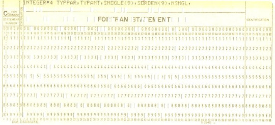
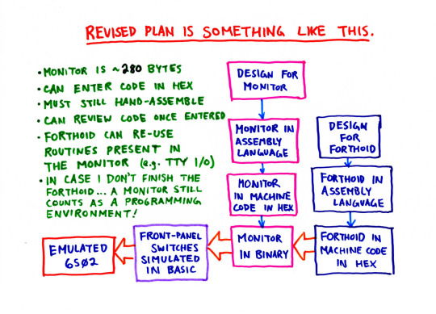

Bootstrap Zero
==============

_being a record of the posts made to the Bootstrap Zero blog during
RetroChallenge 2015/07_

Write it by hand
----------------

_May 31, 2015_

Say you want to write a program.  You need to pick a programming language to write it in — BASIC, say.

Then, to run it, you need a BASIC interpreter.  But what if you don't have a BASIC interpreter?  Then you need to write one.

But a BASIC interpreter is a program, too.  You need to pick a programming language to write it in — assembly language, say.

Then, to assemble it, you need an assembler.  But what if you don't have an assembler?  Then you need to write one.

But an assembler is a program, too.  You need to pick a programming language to write it in.

You could write it in assembly, or even BASIC; but since you don't have an assembler or a BASIC interpreter yet, you won't be able to run your assembler, and it won't be very useful to you.

So, what's to be done?

**Write it by hand**.

Then convert it to machine code by hand.  Then put that machine code into the computer somehow.

This will be the general theme of [Cat's Eye Technologies](http://catseye.tc/)' project for [RetroChallenge](http://retrochallenge.org/) 2015/07: **assume there is no programming environment available on the machine, write one, convert it to machine code, and enter that machine code -- manually.**

We're still working out the details, but...

Lacking appropriate physical hardware to do this on, we'll be using an emulator.

Being most familiar with 6502 and the Commodore 64 architecture, the emulator will probably be [VICE](http://vice-emu.sourceforge.net/).

If there was *really* no programming environment *at all* on the machine, the code would need to be entered in a very primitive way -- setting DIP switches, for example.  We probably won't go that far.  But we will try to come up with something comparably crude for the code-entry part.

The programming environment might not be BASIC, and it might not be an assembler; it's more likely, in fact, to be something like FORTH.

(Or, depending on how it goes, it might be something completely different! But it will definitely follow the theme of **writing it by hand**.)

Why write it by hand?
---------------------

_June 23, 2015_

In the previous post, I outlined the project that
[Cat's Eye Technologies](http://catseye.tc/) plans to do
for [RetroChallenge](http://retrochallenge.org/) 2015/07:
writing a programming environment by hand.

But I didn't go into *why* I chose this project.

The reasons are fairly simple.  In 2015, and in fact for decades now,
software for computers has been developed almost exclusively with the aid of computers.

The sheer pervasiveness of this situation might almost lull you into an impression that it has always been done this way.

But, even if you don't know the history, you can logically reason that it can't possibly have *always* been done this way; in order to develop software using a computer, there needs to be software *on* that computer first.  It's a chicken-and-egg problem.

The very first computers must have had *no* software on them, and the software for them must have been developed *without* using a computer, and then loaded into the computer... somehow.  Only after that point could the computer be used to develop more and newer software for itself.

This situation, incidentally, explains the name of this blog.  Getting over this chicken-and-egg complication is called **bootstrapping**, after the mythical idea that one might reach down and, grabbing hold of one's own boot-straps, lift oneself off the ground.  The concept shows up in several places in computer engineering, particularly in compiler development, but even in the common process of powering on a computer: we say the computer "boots", which is just a shortening of "bootstrap".

Meanwhile, "zero" refers to the fact that there is no software on the computer yet, and suggests an origin point; we are starting with nothing. (OK, even if that's not *absolutely* true, let's say we're trying to get as
close to the "zero point of software development" as reasonably possible.)

Or to put it another way: **pen and paper is also a programming environment**.

And, since it's *so* much easier to develop software using a computer, it's rather a foreign environment these days.  So let's revisit it, lest habituation to screens and keyboards dulls our imagination!

For the next post, I hope to write a bit about the part where the code is actually loaded into the computer (since that's the part we're going to fudge the most, so I'd like to impart what it's like, the best I can.)  And while July is underway, I hope to be able to update the blog regularly with photos of the handwritten materials.  Stay tuned!

Loading the code
----------------

_June 26, 2015_

The most “cheating” part of this project will be avoiding the actual loading of the machine code into an actual machine, so I feel that should describe what it would _actually_ be like, in the real world.

For the sake of example, assume we’ve already written a programming environment — the one that we want to put into our computer, a computer that doesn’t have any sort of programming environment on it yet. Assume we’ve written this program by hand, on paper… and that we’ve already converted it all into machine code.  The first line of it might look something like this:

…followed by many, many more lines.

There are, of course, many ways to get a program into a computer – that is, into its memory.

In the modern world, we would just open a text editor and start typing in the program. But think of how much hardware and software is required to support this! Decoding the keystrokes from the keyboard is not terribly complicated, but displaying characters on a video display is quite another matter. And never mind that the text editor is yet another program that someone had to write (and get into the computer somehow.)

I’ll describe a much more primitive method here.

Glossing over some of the details, a typical memory circuit has a number of **address lines**, a number of **data lines**, and a **read/write gate**. For example, a 64 kilobyte bank of memory might have 16 address lines and 8 data lines.

To locate a byte in memory, you put a binary-encoded version of its address on the address lines. To read that byte, you set the read/write gate to “read” and look at what value is on the data lines. To write a byte, you instead put the value you write onto the data lines, and set the read/write gate to “write”.

Normally, the CPU is doing all this memory-access. But all these lines, **they’re just wires with voltages on them**. So you can do all this reading and writing **by hand, using switches**.

In fact, the front panels of some of the earliest home computers had switches and lights on them for just this purpose, like the Altair 8800 shown here:

And in the absence of any other hardware, **this was how you programmed it.** You flipped the switches to represent the binary value you wanted to write into memory, and pressed a button to write it.

I was going to walk through this process and ask you to imagine it, but [@retrochallenge](https://twitter.com/retrochallenge) pointed out the [1802 Membership Card](http://www.sunrise-ev.com/membershipcard.htm), which is a kit based on the COSMAC ELF, which, like the Altair 8800, was programmed with front panel switches.

So instead, you can [read the instructions for 1802 Membership Card code loading](http://www.retrotechnology.com/memship/mship_test.html),
or watch [this video](https://www.youtube.com/embed/ZgTkOW70MHs?feature=oembed) to see what loading code this way is like.

And now that I’ve shown you this, there is something I’d like to point out...

There’s a simple improvement over switches that’s fairly obvious when
you think about it a bit. Instead of manually changing the switches with
your fingers, why not have some kind of mechanical contrivance which sets the
switches according to a pre-arranged pattern?

Indeed, this technology exists, and you have probably heard of it: the _punched card_.

At its simplest, a punchcard reader is barely any more complex than front-panel switches. When a card is inserted, switch contacts close where there are holes in the card, and stay open where
there aren’t holes. And then that bit pattern gets written to memory. As a bonus, the punched card serves as a record of the bytes that were written to memory, and can be re-used.

If anything, it’s the technology of card _punching_ that’s more advanced. In the example above, the card puncher has printed at the top, by what looks like a dot-matrix printer, the characters for the values it has punched holes for below. But that’s certainly not necessary; in principle, you could punch out the holes by hand, using a hole-punch.

## Simulating loading the code

OK! Now that I’ve imparted to you what it’s like, I’m going to explain
why I’m going to take the liberty of not actually doing it this way, and how I plan to fudge it :)

This project is primarily about _making_ a new software development environment
(using the existing “software development environment” of pen and paper)
to be used on a computer. The act of actually _putting_ it
there is secondary — still important for context, of course, which is why I described it
in detail.

Also, if all the computer has is front-panel switches and lights, then maybe
putting a programming environment onto it isn’t the most useful
thing you can do. Yes, it’s easier to write a program in BASIC instead of in
machine language, but if you still have to enter your BASIC program, byte by
byte, in binary, using switches or by punching holes, that’s still quite a bottleneck.

My point here is that front-panel switches and punchcard readers can load code into a computer
_directly_, at the hardware level. Most other input devices — keyboards, serial 
ports, etc. — can’t do that; they’re too general-purpose. To load code, they would need to 
work in concert with some software routines that interpret the input they 
receive.

Ah, but a programming environment could contain such software routines! In fact, if the purpose of a programming environment is to make it easier to develop software, then arguably it should let you use these easier-to-use, general-purpose input devices for this task.

So, since the hardware for this project is going to be emulated anyway, what I would like to do is assume that the machine has, along with **simulated front-panel switches,** some kind of **simulated teletype **attached to it.

We’ll enter the programming environment into the computer by the front-panel switches. But the programming environment itself will use the simulated teletype to interact with the user.

The actual architecture will probably look something like this:

*   An emulator for a 6052-based computer (probably a Commodore 64).

*   A little program that simulates front-panel switches, reading in strings of binary digits like **00000100** from the C64 keyboard and writing values (in this case, 4) to successive locations in memory.

*   A pair of machine-language subroutines for reading a line of text from, and writing a line of text to, the simulated teletype. **In principle**, we could write these subroutines so that they actually talked to a teletype. **In practice**, they’ll probably be implemented with calls to C64 KERNAL routines for reading from the keyboard and writing to the screen.

If that seems rather “cheaty”, well... I agree, it’s not ideal, but I’ve only got a month to finish this :)

Since this might be the last blog post before I begin, I’ll mention a few other things you can expect from this project.

*   The program will be designed, programmed, and hand-assembled, on paper.
*   Updates to this blog will consist mainly of photos or scans of those papers... I won’t be writing posts about the design.
*   I will have a hardcopy of the [Commodore 64 Programmer’s Reference Guide](http://catseye.tc/node/Commodore_64_Programmer%27s_Reference_Guide) which I will feel free to consult, but I’ll try very very hard not to consult the Internet.
*   I might do a little warmup first (like, “echo the lines you type in”) before starting on the programming environment proper.
*   The programming environment will probably be very similar to FORTH. I will definitely be trying to keep it small (I will have to enter all these bytes, in binary, at the end!) while aiming to make it easier to program with than assembly.
*   The programming environment won’t use any features of the C64 except for those two KERNAL routines to simulate a teletype.

*   I won’t hesitate to save the emulator’s state while entering the code, so I don’t have to do it all in one sitting. But... I'll try very hard not to abuse that feature, to e.g. “undo” entering wrong code. (This suggests the programming environment should contain some kind of debugger...)

And, er, that’s it! Can’t wait to start!

The warm-up
-----------

_July 3, 2015_

* * *

* * *

* * *

All written! Now, to load it (see _Loading the code_ above for details on this)...

A better front-panel simulator
------------------------------

_July 5, 2015_

One thing that disappointed me slightly during _The Warm-up_ was that the simulated front-panel loader was not terribly realistic. It lets you backspace to erase bits you’ve typed in, and it leaves a “paper trail” of values you’ve entered, on the screen. It occurred to me that it wouldn’t be too difficult to write something that simulates a front panel better, so that is just what I did.

The front-panel simulator below works a lot like the 1802 Membership Card front panel (see _Loading the code_ for more details on that.)

The screen shows an approximation of 8 LEDs and 8 SPST switches that would be connected to the 8 data lines on a real front panel.

The keys on the bottom row of the keyboard move each switch down; the keys in the 2nd-to-bottom row move each switch up. (In an effort to be more realistic, they are not toggled by a single key.)

Pressing Return causes the binary value selected by the switches to be written to the current address in RAM. That value is then reflected in the LEDs.

Other simulated buttons (not show in the UI) are

*   `=`, which advances the address by one (you typically press this every time you are happy with the current byte you have written,)
*   `&amp;` which resets the address to the beginning of memory (which can be used to review the bits you’ve entered by stepping through them with `=` and watching the LEDs), and
*   `!` to execute the machine code at the current address.

I plan to use it to enter the machine-code monitor program I’m writing (more on that in a future post.)

I’ll put the code for this front-panel simulator (and other code from this project) in a repository on Github at the end of the month (or earlier, if someone requests it.)

Cheatsheets and chickenscratches
--------------------------------

_July 6, 2015_

I decided, while I was writing all this code by hand, I might as well also write out some stuff about 6502 programming that I can never remember when I need it.

Sketches of the design and code for the machine-language monitor. It was basically written three times; once in pencil, once with a ballpoint pen, and the final version (not shown here, coming soon!) with fineliners.

SITU-MON
--------

_July 9, 2015_

I love bits. Bits are great when you’re coding and you want 2,000 of something
------------------------------------------------------------------------------

_July 12, 2015_

(with apologies to Mitch Hedberg for the title of this post)

Right! So almost as soon as I finished writing the code for SITU-MON, I started entering it into the emulated Commodore 64, using the simulated front-panel switches. At first this was in dribs and drabs, a few bytes here, a few bytes there.

I won't bore you with thousands of screenshots; it all looked basically as described in _A better front-panel simulator_, above. (And for what it would look like in the physical world, watch the video on the _Loading the code_ post.) It’s not difficult, exactly, it’s just tedious and fatiguing.

Finally, I had entered all 2,000 bits, and I reset the address to the beginning, planning to review the bits I had entered to confirm they were the same bits that were written on the paper.

To my considerable surprise, they were completely and utterly different bits than on the paper. They were nothing like what I entered.

Then I realized what had happened. The SITU-MON code starts at $8100, but this is inside BASIC's default memory range, which extends up to $9FFF. Also, the improved front-panel simulator creates a lot of temporary strings compared to the first version. These grew downward in memory and completely clobbered the 250 bytes I had entered!

So I lowered the top of BASIC memory, and started all over again.

The second time doing this, at least, I was able to enter the bits much more quickly; I had had practice, and had a block of time to myself that I could dedicate to it. And when I reset the address to review the code, it was, in fact, the code I entered.

Well, mostly. I skipped a byte about 80% through. So, I re-entered the last 20% and reviewed it again. In the second review, I found one wrong byte, but thankfully it was all in sequence and I didn't have to shift anything.

Satisfied that what was in the computer matched what was written down on paper, I reset the address to the beginning again and... executed!

And nothing happened. It just hung.

Thus, the debugging began.

I pressed RUN/STOP+RESTORE and re-RUN the front-panel simulator — the moral equivalent of pressing a Reset button on a single-board computer which resets the CPU to a known state without affecting the contents of memory.

But how to debug something like this?

I looked back to the listing on paper and traced the execution path through it, as best I could, by hand. I couldn’t see where there was a problem.

The first routine the code calls is `WRITE_PROMPT`. In the front-panel simulator, I advanced to the `WRITE_PROMPT` routine and executed it. And I got this:

Yeah, no, that definitely wasn’t in the spec.

A mild panic set in. The bug could be _anywhere_. I might’ve written down the wrong binary for a hex value; I might’ve written down the wrong hex value for an opcode, or I might’ve made a programming error in the code itself.

I had just finished entering 2,000 bits on a simulated front-panel — for the second time! — and I was in no mood to spend the rest of the weekend, or possibly the rest of the RetroChallenge, poring over my program.

So I took a bit of a mulligan. It was a small thing, and I could rationalize it by saying _“let’s pretend there are 16 green LEDs on the front panel for the address lines”_ or something. But still, I’m not proud of it, and it should count against my RetroChallenge score (however vague and nebulous a concept that may be.)

I converted the address of the `OUTPUTLN_TTY` routine to decimal (33153), dropped to BASIC, and `PEEK`’ed that address to see what byte was there. The first instruction of `OUTPUTLN_TTY` is `LDA #$00`, so I was expecting to see 169 ($A9), but...

Noticing that the byte just _before_ `OUTPUTLN_TTY` was $81, it occurred to me: maybe I made a mistake assigning addresses to labels.

So I read over the code again, and, indeed.

See the problem?

So! A bit painful that this mis-numbering happened so early in the code, but, there was nothing to be done except to go through it all and correct the addresses:

And then, back to the front-panel simulator. Reset the address to the beginning. Keep advancing the address until you get to the next byte that needs correcting, enter the new byte, repeat. A little nerve-wracking, but not terribly difficult, because I was getting pretty used to this by now...

Then, reset the address to the beginning again, and… execute!

Hey! That looks... like what I expected! Let’s see if it works:

It works! It works!

This is a very nice feeling — one that makes up for the earlier disappointments.

So now... we have a machine-code monitor! It’s crude and ugly, but it does the trick, and it’s small — 250 bytes, or maybe 251 bytes now, because of the addressing correction? I’m not sure, but it’s still less than 255 bytes, and that’s great.

We’re not done, though! A machine-language monitor is a _kind of_ a programming environment, but it’s not a very good one. We won’t have to convert anything to binary, and entering lines on a keyboard is a lot easier than using front-panel switches. But we do still need to hand-assemble our code to hex, and compute addresses and so forth, which means we’ll still be using paper a lot.

Here’s an example of how much easier it will be, though. It’s a fancier version of the warm-up exercise, the “echo” program. It displays a sort of prompt between lines, and lets you quit by starting the line with a period.

Note that, since we don’t have to convert to binary anymore, we can format the listing on paper more compactly. Entering and reviewing and running it is a matter of a few monitor commands:

And we test it a bit to make sure that it works as designed...

I’m quite happy with this!

Now, to design and write a _better_ programming environment that we can enter into the computer using SITU-MON here...

SITU-SOL
--------

_July 26, 2015_

Now, the program listing! No, wait — I don’t want you to get the impression that this just appeared fully-formed on paper. So, first, I’ll ask you to imagine about 30 sheets of paper that looked something like this:

OK, now the program listing!

...

All written and hand-assembled!

At this point it’s handy to have a list of the entry points, so I wrote that up too:

Now, to enter it... luckily, entering hex digits with SITU-MON is a lot easier than entering bits using front-panel switches.

All done!

Of course, I made several errors.

I caught one error while reviewing what I had entered with the M command. I had simply mistyped a line. That one was easy to fix.

Other errors — I had to test the program first.

And in order to test it, I needed to have a symbal table for it to work on. I made one up with two very simple “commands” whose effect would be both obvious to see, and non-intrusive on the rest of the system. I decided to have them call two of the simpler routines present in SITU-MON (`WRITE_PROMPT` and `INCR_ADDR`). (And yes, you’re right, they should really be called `$ADDR` and `$INC`, with the dollar signs — thank you for paying attention to the spec. But, this was just to test...)

I wrote the test driver so that I could A8200 then G in 
SITU-MON, enter a few symbals, and then, after it returned to SITU-MON, 
`AC100` then `M` to look at the code it generated.

One obvious symptom during testing was that `SKIP_SPACE` didn’t seem to
do anything at all. It turned out that I had completely mis-assembled
`LDY LINE_OFF`. (You can see this fix, and all the other fixes, in the
listing above, if you look for them.)

Another one was that the addresses in the generated code weren’t right. It was
emitting `JSR`’s to the size-part of the symbal table record, not the compiled
code. It turned out that in `LOOKUP_SYMBAL` I had forgotten that
`ADD_TO_STAB_PTR` gets its input from the memory location `STAB_DELTA`, and not
from the accumulator. Luckily the fix was easy: add a new entry point called
`ADD_A_STAB_PTR` just before `ADD_TO_STAB_PTR`, and call that one instead.

Once I fixed that, I was able to compile simple “programs”:

There was still one more bug. The code generated when compiling a `!` (repeat) was wrong — it was jumping one byte too far back in memory. Once spotted, that was another easy fix. And then...

Huzzah!

A moderate success. We have, on this emulated computer, a programming environment, hand-written and hand-assembled and hand-entered in hexadecimal (using a less sophisticated programming environment, which was itself hand-written and hand-assembled and hand-entered in binary using simulated front-panel switches.)

But why do I consider this a moderate success rather than an unqualified success? Well, I’ll write a retrospective blog post on that topic shortly; stay tuned! :)

Retrospective
-------------

_July 28, 2015_

What have I learned from this? What would I do differently, if I had to do it all again?

**Writer’s cramp**. I really didn’t forsee that. I probably should’ve, but I didn’t. My wrist seems OK now, but last week it was definitely a bit ache-y, and I scaled back my ambitions a bit because I didn’t want to stress it too much. I guess it’s been a while since I’ve written this much.

**Uneven columns of text**. I wrote the “nice” version of the code on printer paper placed over lined paper, to keep my rows straight, but I really should’ve used graph paper instead, to keep my columns straight too. Or [French ruled paper](http://blog.shopwritersbloc.com/notepads_paper/what_is_french_ruled_paper.html), or a [ledger](http://3.bp.blogspot.com/-Dd5xQGuzzRY/UV2v8FgEDiI/AAAAAAAAABg/kOQ7W_Mn8Ls/s800/Cash+Book.png), or something. Also, putting more thought into choice of colours, etc., would’ve been nice.

**Assembler-ness in hand-assembly.** I only flaunted the fact that I didn’t have to please an assembler’s idea of syntax a little bit: I used the same “local labels” like NEXT: over and over again, since I knew very well which one I meant at each point. An assembler program would’ve wanted me to call them NEXT1, NEXT2 or whatever, to keep them apart. I even used underscores in these labels, purely out of habit, but of course they weren’t at all necessary. I could’ve even gone much further -- I could’ve just drawn arrows from one part of the code to another. I kind of regret not doing something more “artistic” like that.

**No LEDs for the address lines**. As I mentioned in the _I love bits_ post, it would’ve saved a significant amount of debugging if I had known _what_ address I was entering bits _at_. That’s a definite advantage the nice big front-panel of the [Altair 8800](https://upload.wikimedia.org/wikipedia/commons/0/01/Altair_8800_Computer.jpg) has over the austere front-panel of the [1802 Membership Card](http://www.sunrise-ev.com/membershipcard.htm). But even showing the lowest 8 bits of the address would’ve been useful as a guard against this sort of address-misalignment problem.

**No padding between routines**. I hand-assembled each routine to start at the very next address available after the previous routine. My excuse was that I didn’t want to have to enter more bytes than I had to. But this is a risky practice, because it’s quite easy to miss an instruction, or to want to insert an instruction later, for debugging; but if there’s no free space after the routine, you need to figure out what to replace with a JMP to somewhere else in memory (which will JMP back to continue the routine), then you need to find somewhere else in memory to put it... it’s a mess. I was lucky in that I didn’t hit a problem that required this. But it was luck. It would’ve been smarter to add 3 or so NOPs after the end of each routine, to make adjusting the routine easier, if needed. Even if it would’ve meant entering 24 more bits each time.

**No comments**. Yeah, that’s the thing, see. Writing documentation by hand is harder than writing code by hand because documentation is... sentences. The fact that you’re already writing out the “important” stuff seems like a good excuse to leave out the “non-critical” stuff like comments. But the comments _are_ important -- especially in assembly language, where it’s really important to define what each routine expects when it is called, and what the rest of the program can expect when it’s finished (preconditions and postconditions.) If you fail to pay attention to these when writing code that calls that routine, very bad things can happen. Most of my first drafts did include scribbled preconditions and postconditions, but those notes didn’t make it to the final listings.

**The language is a bit goofy**. And incomplete (no real standard library.) Well, I kept going back and forth on whether I should make a FORTH-like language or a LISP-like language, while at the same time wanting to keep it as simple as possible... and eventually simplicity won out. The resulting design for SITU-SOL has some similarities to [Shelta](http://catseye.tc/node/Shelta), which I suppose isn’t surprising.

...

OK, those are the basic ones. But the big one is:

## **A programming language alone does not a programming environment make!**

See, one reasonable way to interpret the goal of this project of writing code by hand, is to write enough code by hand so that you don’t have to write code by hand anymore.

But SITU-SOL doesn’t accomplish that goal. If you wanted to write a non-trivial SITU-SOL program... you’d probably want to write it out by hand first!

:(

In other words... I probably should’ve just written a text editor instead. Maybe next year?

Well, that’s not quite a fair assessment, either. Let me explain...

In the modern world, we’d write our program in our text editor, and we’d assemble it with our assembler program, which is a separate thing.

But uncompressed text takes up a fair amount of space, and on 8-bit machines, with their modest RAM and slow (or non-existent) persistent storage, that space is at a premium. So programming environments like BASIC do clever tricks like **tokenizing** the source code; an instruction like INPUT, even though it is entered as five characters, can be represented by one byte in memory, and displayed as those five characters again when the program is LISTed. Forth can do a similar trick (although I admit I’m not familiar with exactly how Forth is spec’ed to work, in this regard.)

So, once I got SITU-MON in, I probably should’ve written a text editor, so that I could design and write and edit further programs directly on the computer, without using paper.

But once I came across the idea that SITU-SOL’s code could be _both_ compiled _and_ tokenized (i.e., treat `JSR $xxxx` as a “token” that prints out the symbal-name just before $xxxx when it is decompiled, and so forth) -- that’s pretty neat, and I felt I had to go in that direction. (Maybe that’s how Forth works, too. I should look that up.)

Anyway...

To achieve this “edit directly on the computer, avoid paper” plateau, there are at least 3 more things the SITU-SOL environment should do:

*   Let you list the symbals that have been defined so far. (Like Forth’s `WORDS`, but I guess it would be called `$SYMBALS` here.)
*   Let you see the contents of a symbal’s definition, in a human-readable format.
*   Let you change the definition of a symbal. Or, if you can’t do that directly, let you replace every call to one symbal, with a call to a different symbal, in every defined symbal. (Then instead of changing a symbal, you write a new symbal and replace all the calls to the old one.)

Now, I _did_ design SITU-SOL to support these things... and I _have_ written code to do these things! I include it below, for completeness. But I don’t think I’ll have the time (or the wrist-stamina) to hand-assemble it and enter it before the end of the month.

The code for `$SYMBALS`:

Dumping the contents of a symbal:

Replacing all calls to symbal1 with calls to symbal2:

Calling those last two routines from the interactive prompt, with `/D SYMBAL` to dump and `/R SYMBAL1 SYMBAL2` to replace calls to symbals:

So, if the point of this project was to write the code by hand, I can indeed say I have written those routines by hand! Not assembled, entered, or tested... but written, yes!

## Future work

I’ve created a [Mercurial repository on Bitbucket](https://bitbucket.org/catseye/situ-sol), which is mirrored in a [git repository on Github](https://github.com/catseye/SITU-SOL), where I’ll be placing the support materials and binary images from this project, and maybe in the future... other stuff, like a disassembly of the code that was entered.

One of the reasons I entered SITU-MON at $8100 was because when the Commodore 64 is booted with an 8K cartridge attached, that ROM appears at $8000. I didn’t start right at $8000 because I wanted to reserve room for the header (the bit of ROM that tells the C64 "yes, this is a cartridge”) and some routines to do some initialization.

So, one thing I’d really like to do is make such a binary image. Even if only to use it in the emulator. Because it’d be kind of cool to boot the machine directly into SITU-SOL. But that’s a bit outside of the scope of this RetroChallenge project.

But after July ends.... who knows?
