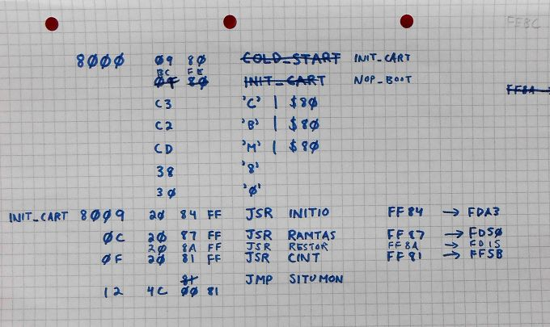
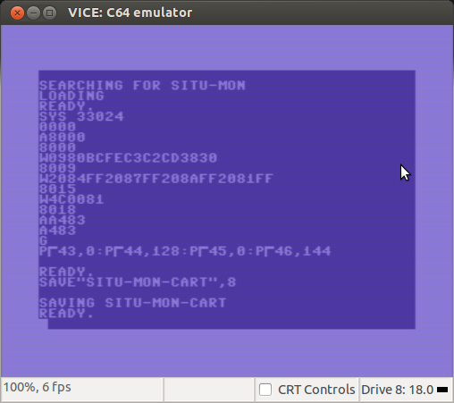
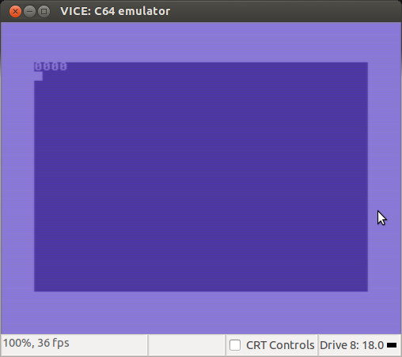

Booting from a cartridge
========================

_mid-May, 2016_

Booting SITU-MON from a cartridge
---------------------------------

This mini-project will be to get SITU-MON booting from a cartridge image.
This is not for RetroChallenge; this is an off-season project.  And while
SITU-MON and SITU-SOL are generic 6502 machine language programs, this project
is somewhat more C64-specific.

SITU-MON starts at $8100 and SITU-SOL starts at $8200; these addresses were
chosen so that they fall within the address space of a Commodore 64 cartridge,
$8000-$9FFF.

The Commodore 64 can boot from a cartridge, if the cartridge contains an
autoboot signature in its first few bytes at $8000.

When the KERNAL detects a cartridge and autoboots it, there are some things
it doesn't do which it would normally do if it was booting into BASIC.  So,
along with this header, we will need some startup code in the cartridge
which does these things, then starts SITU-MON.

So the plan is:

*   Use SITU-MON to write the signature to $8000 and the startup code just
    after it, at $8009.
*   Save the memory range $8000-$8FFF to a binary image.

What signature do we need?  It's described on page 263 of the Programmer's
Reference Guide, but basically it's

*   Address of the code to run for cold boot when the cartridge is
    plugged in — which will be our startup code at $8009.
*   Address of the code to run for cold boot when the cartridge is
    plugged in.  I'll just use $FEBC, which I picked up somewhere along
    my travels as a "magic address" to assign to the warm-boot vector to
    disable RUN/STOP-RESTORE.  In fact, if you look at the code at that
    address, it's just the tail of a KERNAL routine that just cleans up
    the stack and `RTI`'s.  I'm not actually sure how well it will work here.
*   The magic characters `CBM80`, in PETSCII, and where the first 3
    characters have their high bit set.

What startup code do we need?  It's described (sort of) on page 269.  Reading
it, and the description of the KERNAL routines in pages 274-306, it's apparent
that it calls the KERNAL routines `IOINIT`, `RAMTAS`, and `CINT`.  What's
less apparent is that it also calls `RESTOR` before `CINT`.  This took a
little testing (and a peek at a disassmbly of the KERNAL's `RESET` routine)
to figure out.  It would have been nice if the Guide had just names the 
KERNAL routines involved.  But oh well.  Here's my chicken-scratches:

How do we save the memory range?  Well, we could tell the emulator to do it,
but in fact there is a way to get a Commodore 64 to save an arbitrary chunk
of its memory to a disk file.  (On an Apple II, the DOS command which does
this is called `BSAVE`, but true to form, doing the equivalent thing on a
C64 involves a series of obscure `POKE`s.) 

    POKE 43,0:POKE 44,128:POKE 45,0:POKE 46,144
    SAVE "SITU-MON-CART",8

Those `POKE`s change BASIC's idea of where the BASIC program begins and
ends in memory, effectively tricking it into saving $8000-$8FFF.  Yes, OK,
this is only a 4K cartridge image, but that should be fine for now.  And
there is a small caveat: when you save a memory image like this, the first
two bytes contain the load address.  VICE seems to understand this, for
cartridge images, but other tools, such as an EPROM burner, might not,
because those two bytes would not be present on a real ROM itself.

But first, there's a wrinkle.  When SITU-MON was written it was not given
the ability to exit, so how do we even drop to BASIC?

Well, we can set the address to the BASIC warm boot routine, and then call
it.  We call it as a subroutine, because that's all SITU-MON can do, but
BASIC will never return to SITU-MON, so in effect we lose a few bytes of
stack space.  This is fine.

    AA483
    G

So, putting this all together, here's a screenshot of using SITU-SOL to
make these changes, then using BASIC to save the cartridge image to disk:

Then... in VICE, select "Attach raw 8K cartridge image..." and select the
file we just saved and voilá!

Nothing fancy, but then I didn't expect it to be.

Booting SITU-SOL from a cartridge will be the next step, but it's slightly
harder, for two reasons:

*   The symbal table starts at $0900, which is not inside the address space
    of the cartridge.  So a symbal table will need to be copied there, from
    the cartridge, during boot.
*   I have not actually defined an actual default symbal table with proper
    built-ins for SITU-SOL yet.  So we may have to make do with the demo
    symbal table that was thrown together during RetroChallenge 2015/07.
